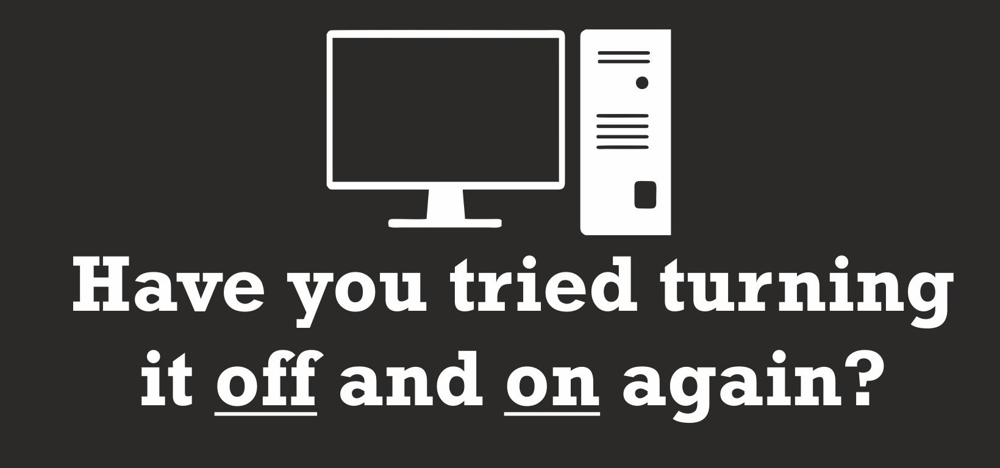

    

## Requirements
- Node.js (version 12 or higher)
- npm (package manager)

## Usage
To use the rules, you can either download the JSON from the link below or integrate with the API.

- [Download the rules](https://raw.githubusercontent.com/Lovi-0/Turn-it-off/refs/heads/main/output/data.json)

## Initial Documentation
For more details on how the dynamic rule system works and how to manage rules, check out the documentation for the 
- [Dynamic Rules Mechanism](https://github.com/austinogola/onlyfans-dynamic-rules/blob/refs%2Fheads%2Fmain/doc%2FREADME.md)